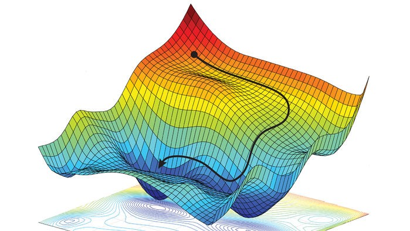

# Neural Network Basics

## 1. Neural Networks' Concepts

Here, we will use logistic regression to explain some basic concepts of neural networks.

### 1.1. Binary Classification

A binary classification is the task of classifying elements into two groups. So, for example, such a task could be to classify a given image into the following categories: 1. contains a cat and 0. does not contain a cat.

Let's talk a little about the notations of our training dataset. If each example in our dataset contains $n_x$ features and we have $m$ training examples, then we represent our dataset as a matrix ($X$) where each column is an example, and which has dimensions ($n_x$, $m$). Our output can also be represented as a matrix ($Y$) where each output of the classification is a column, so the matrix has a dimension ($1$, $m$).

### 1.2. Logistic Regression

The logistic regression is a learning algorithm that you use when the output labels $y$ in a supervised learning problem are all either zero or one. A supervised learning problem is a problem where all your inputs are already labeled, so your algortihm knows what outputs are expected.

In the logistic regression case, given an input $x$, we want our model to give us an output $ŷ$ that corresponds to the probability that $y = 1$. As we said before, our input $x$ has $n_x$ features, so our logistic regression model will also have a parameter $w$ with dimension $n_x$ and a constant $b$. If we do the following formula, then we would have a linear regression, but it is not a very good model because we want $ŷ$ to be between $0$ and $1$.

$$ ŷ = w^Tx + b $$

With this formular, our $ŷ$ could be much larger than one or even negative. So in reality, we are going to apply an activation function is this formula - the sigmoid function, that guarantees that the values stay between zero and one. The sigmoid function has the following format:


The sigmoid function has the following formula:

$$ \sigma(z) = \frac{1}{1+e^{-z}} $$

So, our actual logistic regression function looks like this:

$$ ŷ = \sigma(w^Tx + b) $$

So, when you are training a logistic regression, you are actually learning the best possible values of $w$ and $b$ so that $ŷ$ becomes a good estimate of the chance of $y$ being equal to $1$. 

### 1.3. Cost Function

We can define 'loss' as a measurement that help us understand the difference between the predicted values and the actual value. The loss function is the function used to quantify this loss during the training phase. A loss function is used when we refer to the error for a single training example, while a cost function is used to refer to a measure that represents this difference for the entire training dataset.

For the logistic regression, we normally used the following loss function:

$$ L(ŷ,y) = -(y\log{ŷ} + (1-y)\log{(1-ŷ)}) $$

So here the cost function ($J$) is given by:

$$ J(w,b) = \frac{1}{m}\sum_{i=1}^{m}L(ŷ^{(i)},y^{(i)}) $$

So of course our goal here is to find $w$ and $b$ that minimizes our cost function.

### 1.4. Gradient Descent

So the definition of gradient descent is the following: gradient descent is a first-step iterative optimization algorithm for finding a local minimum of a differentiable function. In another words, the gradient descent is an algorithm that takes incremental steps in a function in order to find a local minimum. We use it to help us find the parameters that minimize the cost function. Let's take a look as it works in an image:


You can see that it takes steps towards the minimum point. The steps are larger when the derivative is bigger and are smaller when the derivative is smaller. In a 3D function, the gradient descent would look like this:



What the gradient descent does is to start at the initial point and take a step in the steepest downhill direction - as quickly down as possible. So it repeats the following function until the algorithm converges (considering we are dealing with a cost function that depende only of $w$ - if not the case, we would use partial derivatives):

$$ w := w - \alpha\frac{dJ(w)}{dw} $$

Here, $\alpha$ is the learning rate and controls the size of the step we take on each iteration. The derivative part of the equation is responsable for the behavior we mentioned before: the bigger the derivative, the bigger the step that will be taken.

The cost function $J(w,b)$ that we chose above is a convex function, being a single big bowl with a single local optimal. This is one of the main reasons why we use this function for logistic regression.

### 1.5. Logistic Regression Gradient Descent

Let's talk a little bit how we can implement gradient descent in logistic regression. So far, we have the following two equations that represent, respectively, our output $ŷ$ and our loss function.

$$ ŷ = \sigma(w^Tx + b) $$
$$ L(ŷ, y) = -(y\log{(ŷ)}+ (1-y)\log{(1-ŷ)}) $$

The gradient descent will be implemented calculating the derivative of the loss function with respect to each weight $w_i$, so that we can find all the $w_i$ values that minimize our loss function. In other words, for the gradient descent we need to calculate, as previously said, $\frac{dJ(w_i)}{dw_i}$. We can calculate it and find that:

$$ \frac{dL}{dw_i} = x_i(ŷ-y) $$

The you perform the updates:

$$ w_i := w_i - \alpha\frac{dL(w_i)}{dw_i} $$
$$ w_i := w_i - \alpha x_i(ŷ-y) $$

This gradient descent step is relative to one training example only. But we want to implement gradient descent for $m$ training examples. Our cost function is given by:

$$ J(w, b) = \frac{1}{m}\sum_{i=1}^{m}L(ŷ^(i),y^{(i)}) $$

The derivative of our cost function is also the mean of the derivatives of the individuals loss functions. So, we have:

$$ \frac{\delta J(w, b)}{\delta w_j} = \frac{1}{m} \sum_{i=1}^{m} \frac{\delta L(ŷ^{(i)},y^{(i)})}{\delta w_j} $$
$$ \frac{\delta J(w, b)}{\delta w_j} = \frac{1}{m} \sum_{i=1}^{m}[x_j^{(i)}(ŷ^{(i)}-y^{(i)})] $$

In the folder codes you will find the code [`gradientdescent.ipynb`](codes/gradientdescent.ipynb) where I show the algorithm of one step of the gradient descent - be warned that the code does not work, as it doesn't have a training dataset, it just serves to explain how the gradient descent's step works.

You should also note that the code available serves only for educational purposes, as it has low efficiency because it needs many for loops. The most efficient way to implement gradient descent and deep leraning algorithms is to use vectorization.


## 2. Python and Vectorization

Working with your accounts using vectors instead of using explicit for loops turns out to be much faster. This is what we call vectorization. In the code [`vectorization.ipynb`](codes/vectorization.ipynb) you can see a vector multiplication done with an explicit for loop, which took about 305.09ms, and the same multiplication being performed using vectorization resources, which took about 0.45ms. The thing to keep in mind in neural network programming is: whenever possible, avoid explicit for-loops.

Another example: say you need to apply the exponential operation on every element of a matrix/vector. 

$$ v = \begin{bmatrix} v_{1}\\ \vdots \\ v_{n} \end{bmatrix} \rightarrow u = \begin{bmatrix} e^{v_{1}} \\ \vdots \\ e^{v_{n}} \end{bmatrix} $$

Using a for loop, you would have the following implementation:

```python
import numpy as np

u = np.zeros((n,1))
for i in range(n):
    u[i] = math.exp(v[i])
```

Instead, you can use a vectorized implementation:

```python
import numpy as np

u = np.exp(v)
```

Also, you can use a vectorized implementation of the logistic regression algorithm, meaning we don't need to use a single for loop. We can do that using this formula:

$$ Z = w^TX + b $$

Where $Z$ is a $(1,m)$ dimensional matrix, $w$ is a $(n,1)$ dimensional matrix, $X$ is a $(n,m)$ dimensional matrix and $b$ is a $(1,m)$ dimensional matrix. In code, you would have the following:

```python
import numpy as np

Z = np.dot(w.transpose(), X) + b
```

Now we want to apply the sigmoid function to $Z$ and we can to that by the following:

$$ A = \sigma(Z) $$

You can also using vectorization to compute the gradient descent. We are going to use that:

$$ dZ = A - Y $$

We already got rid of a for loop (remembering that you can follow the code progression in [`gradientdescent.ipynb`](codes/gradientdescent.ipynb)), but we still have a for loop to calculate dw and db te such that:

$$ dw = 0, db = 0 $$
$$ dw = dw + x^{(1)}dz^{(1)}, db = db + dz^{(1)} $$
$$ dw = dw + x^{(2)}dz^{(2)}, db = db + dz^{(2)} $$
$$ ... $$
$$ dw = dw + x^{(m)}dz^{(m)}, db = db + dz^{(m)} $$
$$ dw = \frac{dw}{m}, db = \frac{db}{m} $$

Basically, then, in the vectorized version we can do the following

```python
import numpy as np

db = 1/m * np.sum(dZ)
dw = 1/m * np.dot(X, dZ.transpose())
```

### 2.1. Boradcasting in Python

Arrays with different sizes cannot be added, subtracted or generally be used in arithmetic. A way to overcome this is to duplicate the smaller array so that it is the dimensionality and size as the larger array. This is called array broadcasting and is available in NumPy when performing array arithmetic, which can greatly reduce and simplify your code.

Let's see an example. Imagine we have a matrix with the number of calories from carbs, proteins and fats in 100g of different foods:


We want to calculate the porcentage of calories coming from each source. All he have to do is sum the values in each column and divide each value for the sum of the column. The code [`broadcasting.ipynb`](codes/broadcasting.ipynb) show how we can do this.

The general principal of broadcasting in Python is: if you have a $(m,n)$ matrix and you add, subtract, multiply or divide with a $(1,n)$ matriz, the this will copy it $m$ times into an $(m,n)$ matrix and then apply the opperation element wise. The same thing would happen with a $(m,1)$ matrix.