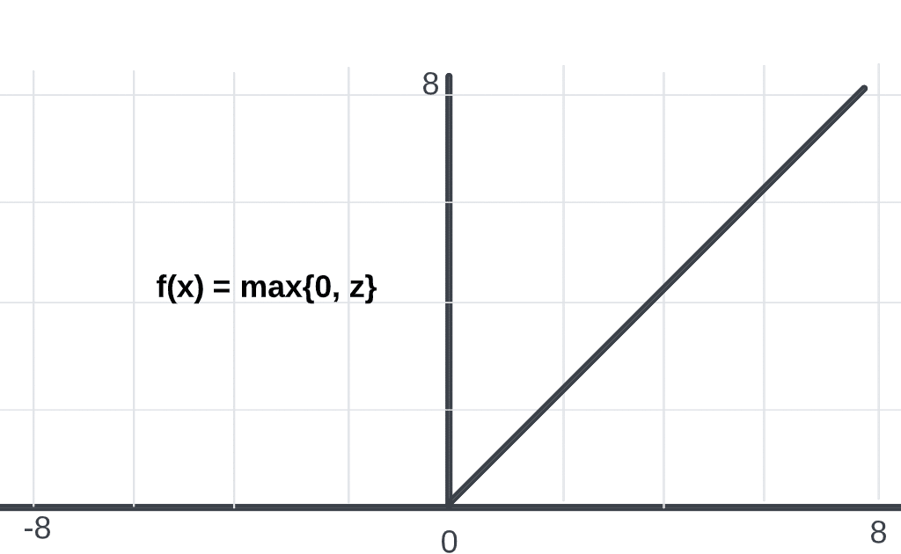

# Shallow Neural Networks

## 1. Overview

We have already seen what is a logistic regression and that looks like this:

The expected output and the loss function are then calculated using the following steps:

A neural network, on the other hand, looks like the following:

You can form a neural network by stacking together a lot of little sigmoid units. The calculation the we saw previously for a single unit will now be applied to all the units in the network. That is, for each unit we will have a $z(x)$ calculation followed by an activation function. 

From on on we will use the superscript square bracket ($z^{[1]} = W^{[1]}x + b^{[1]}$) to refere to each different layer, which is not to be confused to the superscript round bracket ($x^{i}$), that we use to denotate each different training example.

## 2. Neural Network Representation

Let's consider the following neural network:

This vertical line where we have $x_1$, $x_2$ and $x_3$ is called *input layer*, that contains the inputs of the neural network. The following layer of circles is called the *hidden layer* of the neural network. The word *hidden* here means that the true values of the nodes in this layer are not observed, you don't see what their values should be in the training set. The final layer here is formed, in this case, by a single node and is called the *output layer*.

The neural network presented is called a two-layer neural network, because when we are counting the number of layers of a NN, we don't count the input layer.

Each node (in the image represented as circles) is composed by a combination of two functions: a linear function and an activatiopn function. It's very similar to what we have seen in the logistic regression, but repeated several times. 

We calso also vectorize those operations in the following way. Consider the outputs $a^{[1]}$ and $a^{[2]}$ of the first and second hidden layers, respectively:

$$ Z^{[1]} = W^{[1]}X + b^{[1]} , A^{[1]} = \sigma(z^{[1]}) $$
$$ Z^{[2]} = W^{[2]}A^{[1]} + b^{[2]} , A^{[2]} = \sigma(z^{[2]}) $$

The dimensions of $W^{[i]}$ will depend on the number of nodes in the current layer and the number of nodes in the previous layer (for the first layer thius represent the number of features in each traing example), while the dimensions of $z^{[i]}$ will depend on the number of nodes in the current layer and the number of training examples.

## 3. Activation Functions

When we are working with neural networks, we get to choose which activation functions we use in the hidden layers as well as the output layer of our NN. So far, we have only seen the sigmoid function, but there are a lot more functions that we can choose from, and each one is more suitable for an specific case. As we have seen the sigmoid function works like the following:

Instead of the sigmoid function, we can use other functions and then have different outputs. For example, the Sigmoid Function always have outputs that vary from 0 to 1. The Hyperbolic Tangent Function (tanh), in the other hand, has outputs that vary from -1 to 1.

Using tanh function in the hidden units works almost always better than using the sigmoid function, because then the outpúts that come from the hidden layer are closer to having a 0 mean and it has the effect of centering the data.

In the binary classification is common to use the tanh function in the hidden layers and the sigmoid function in the output layer, because we want our final ouput to be a representantion of a probability, and so it should stay between 0 and 1.

One of the downsides of both the sigmoid function and the tanh function is that if $z$ is either very large or very small, then the gradient of this function becomes very small and this can slow down the gradient descent. So another choice we have is called rectified linear unit (ReLU):

The rule of thumb for choosing activation functions is: if your output is a 0 or 1 value, if you are using binary classification, then the sigmoid activation function is a very natural choice for the output layer. And the for all other units the ReLu is the default choice of activation function.

One disadvantage of the ReLU is that the derivative is equal to zero when $z$ is negative. In practice it tends to work just fine, but there is another activation function called Leaky ReLU that is similar to ReLu, but when $z$ is negativa, it just takes a slight slope form.

In conclusion, we have:

| Activation Function | Pros                                                                            | Cons                                      | Conclusion                                             |
|---------------------|---------------------------------------------------------------------------------|-------------------------------------------|--------------------------------------------------------|
| Sigmoid             | Output stays between 0 and 1                                                    | Slope is small for z to large or to small | Almost never use it, unless is a binary classification |
| TanH                | Output between -1 and 1                                                         | Slope is small for z to large or to small | Better than the sigmoid function, not much used        |
| ReLU                | Slope not small for large and small values of z                                 | Slope is 0 when z is negative             | Most commonly used                                     |
| Leaky ReLU          | Slope not small for large and small values of z and not zero when z is negative | -                                         | Works good, but is not as used as ReLU                 |

We need non-linear activation functions so that the neural network is capable of learning non-linear functions. If we always use linear activations functions, or if we don't use activation functions at all, than it doesn't matter how many layers our network has, in the end it will always just be computing a linear function. The one place you might use a linear activation function is the output layer in regression problems, but in your hidden layers you should always use non-linear activation functions.

## 4. Forward and BackPropagation

So, we have seen that, for a two layer neural network, the forward propagation equations looks like this:

$$ Z^{[1]} = W^{[1]}X + b^{[1]} $$
$$ A^{[1]} = g^{[1]}(Z^{[1]}) $$
$$ Z^{[2]} = W^{[2]}A^{[1]} + b^{[2]} $$
$$ A^{[2]} = g^{[2]}(Z^{[2]}) = \sigma(Z^{[2]}) $$

where $g^{[1]}$ and $g^{[2]}$ are thw activation functions for the first and the second layers, respectively. In this case, because in our example we are talking about a binary classification, our output layer has a sigmoid activation function.

The equations to calculate the back propagation are the following, considering that we use the same loss as we have seen before:

$$ dZ^{[2]} = A^{[2]} - Y $$
$$ dW^{[2]} = \dfrac{1}{m}dZ^{[2]}A^{[1]T} $$
$$ db^{[2]} = \dfrac{1}{m} np.sum(dZ^{[2]}, axis=1, keepdims=True) $$
$$ dZ^{[1]} = W^{[2]T}dZ^{[2]} * g^{[1]'}(Z^{[1]}) $$
$$ dW^{[1]} = \dfrac{1}{m}dZ^{[1]}X^T $$
$$ db^{[1]} = \dfrac{1}{m} np.sum(dZ^{[1]}, axis=1, keepdims=True) $$

These equations can be easily found by computing the derivatives of L with respect to each of these variables, primarily using the chain rule of calculus. I took the time to find them manually and I suggest that anyone familiar with calculus and derivatives also do so for a better understanding of what is being applied, but since the purpose of this summary is not calculus focused, I will go on without further explanation. .

> No codes in this section
> 
> This section has no codes because any code made would be very similar to the code in the course that inspires this study, and so I opted to have only the concepts in this section.